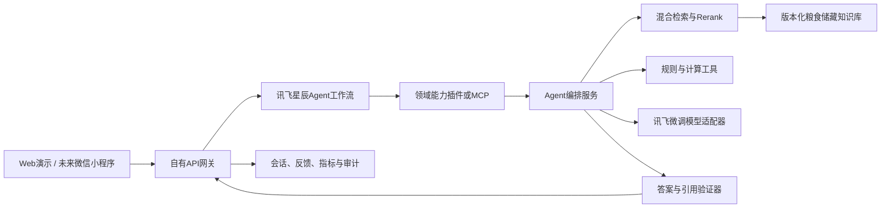

# 从微调模型到粮食储藏专用智能体：产品开发分析报告

**报告日期：** 2026年7月18日  
**项目：** 面向粮食储藏学科的垂类大模型与创新应用  
**当前目标：** 将已完成微调的模型升级为可用、可评测、可上线的专用智能体  
**当前阶段边界：** 完成产品与系统方案；微信小程序只做接口与合规预留，不在本阶段实施

---

## 一、执行摘要

### 1.1 核心判断

当前项目已经完成了“模型与知识资产的原型验证”，但尚未完成“专用智能体产品”。截至2026年7月18日，项目具备以下真实基础：

- 已形成422条粮食储藏领域SFT数据，并完成讯飞平台模型微调。
- 微调模型推理服务当前可正常调用，4个仓库既定问题均能生成结构化专业回答。
- 已构建1023个知识块、2560维向量的本地向量库，覆盖17个知识源。
- 讯飞Embedding实时检索可用，低温储粮、CO2监测、法规等问题能够命中相关文献。
- 已有ChatDoc、Embedding、微调模型推理和Agent平台的探索代码与操作文档。

但是，微调模型与RAG仍是两条分离链路，没有形成统一的智能体闭环；没有正式业务API、工作流成品、前端、自动评测、用户验证、运维监控与上线体系。按“从研究原型到可用产品”的成熟度衡量，当前约为**28%**。该数字是本报告的工程成熟度诊断，不是赛事评委分数。

### 1.2 下一步不应该继续做什么

下一步不应继续单独堆训练数据、反复微调，或先做微信小程序界面。当前最大短板不是模型“会不会回答”，而是：

1. 回答是否有可靠证据；
2. 是否能完成多步骤任务；
3. 是否能处理缺失信息和异常情况；
4. 是否可评测、可追踪、可迭代；
5. 是否能够被真实用户稳定使用。

### 1.3 推荐产品

建议产品暂定名为：

> **粮储智研助手 - 面向粮食储藏教学、学习与科研的可追溯专用智能体**

产品不做泛化聊天机器人，而是聚焦一个高价值闭环：

> 用户输入粮食储藏专业问题或储粮案例条件，智能体完成意图识别、信息补全、权威检索、规则计算、风险分析、分角色讲解和证据引用，并允许教师或学生继续追问、生成练习或导出结构化报告。

核心场景按优先级分为：

1. **可追溯专业问答**：回答粮食储藏技术、法规、标准与科研问题，逐条展示来源。
2. **储粮安全案例分析**：基于粮种、水分、粮温、环境湿度、CO2、虫霉迹象等条件，进行结构化风险分析；信息不足时先追问。
3. **助教与助学闭环**：教师生成案例、题目和评分要点；学生获得分步讲解、错因分析和推荐学习内容。
4. **助研扩展**：文献对比、证据归纳、研究思路辅助，作为Beta阶段功能。

### 1.4 技术路线结论

建议采用**讯飞平台 + 自有后端的混合架构**：

- 讯飞星辰Agent平台负责：工作流编排、平台节点、异常分支、Trace、自动测评、发布API/MCP及比赛展示。
- 自有Python后端负责：微调模型适配、高质量RAG、混合检索、引用组装、规则工具、用户与会话、指标采集、合规控制，以及未来微信小程序的统一入口。
- 微信小程序未来只调用自有HTTPS API，不直接持有讯飞密钥，也不直接耦合讯飞工作流协议。

这是当前最平衡的路线：既能体现讯飞平台使用深度，又能保证产品质量、可迁移性和未来渠道扩展。

### 1.5 时间结论

从2026年7月18日到赛事提交日2026年9月15日共有59天。建议里程碑：

- **7月20日前：** 冻结产品范围、安全基线和评测基线。
- **8月1日前：** 完成知识库2.0、OCR、来源页码与检索评测。
- **8月15日前：** 完成微调模型 + RAG + 两个核心工作流的Agent MVP。
- **8月25日前：** 完成Web演示、Trace、反馈与自动评测。
- **9月5日前：** 完成至少2名、目标10名真实用户试用。
- **9月14日前：** 完成稳定版、演示材料、测试报告和提交包。
- **9月16日以后：** 进入生产化与微信小程序阶段。

---

## 二、报告依据与范围

### 2.1 本地材料

本报告基于以下项目证据：

- `docs/XH-202620_面向一流学科建设的学科垂类大模型与创新应用开发.pdf`，重点为第五部分“答题要求”和第六部分“作品评选标准”。
- `docs/评分细则.xlsx`，Sheet1的7个评分维度、细分项与加分项。
- `training_data/alpaca_train.json`、`training_data/README.md`。
- `vector_store/vectors.npy`、`vector_store/chunks_metadata.json`。
- `build_vector_store.py`、`search_kb.py`、`chatdoc_rag.py`、`test_finetuned_model.py`等代码。
- 项目内讯飞Embedding、ChatDoc、MaaS微调与Agent开发文档。

### 2.2 现行平台与合规资料

本报告还核验了以下官方资料：

- 讯飞星辰Agent开发指南：工作流节点、异常处理、Trace、评测、API/MCP发布。  
  https://www.xfyun.cn/doc/spark/Agent03-%E5%BC%80%E5%8F%91%E6%8C%87%E5%8D%97.html
- 讯飞星火智能体Workflow Open API：工作流发布后可通过流式HTTP API调用。  
  https://www.xfyun.cn/doc/spark/workflow.html
- 讯飞星火知识库API：支持OCR、文档状态、知识库、SSE问答与自定义切分。  
  https://www.xfyun.cn/doc/spark/ChatDoc-API.html
- 《生成式人工智能服务管理暂行办法》。  
  https://www.cac.gov.cn/2023-07/13/c_1690898327029107.htm
- 《人工智能生成合成内容标识办法》，自2025年9月1日起施行。  
  https://www.cac.gov.cn/2025-03/14/c_1743654684782215.htm
- 生成式人工智能服务备案信息公告。  
  https://www.cac.gov.cn/2024-04/02/c_1713729983803145.htm
- 《中华人民共和国个人信息保护法》。  
  https://www.npc.gov.cn/npc/c2/c30834/202108/t20210820_313088.html
- 工信部移动互联网应用程序备案通知，明确包含小程序。  
  https://www.miit.gov.cn/zwgk/zcwj/wjfb/tz/art/2023/art_920db564162e4312916a01bed6540ad8.html

### 2.3 不在当前阶段实施的内容

- 微信小程序页面、登录和提审。
- 大规模多租户商业SaaS。
- 自动控制粮仓设备或直接下发控制指令。
- 替代粮库负责人、教师或科研人员作最终专业决策。

这些内容只在架构、接口、安全和合规层面预留。

---

## 三、当前开发进度审计

### 3.1 已完成

| 资产 | 当前证据 | 结论 |
|---|---|---|
| 微调数据 | 422条Alpaca格式数据，覆盖害虫、低温、CO2、法规、质量检测、智能粮库等 | 已完成v1，但还不是生产级数据资产 |
| 模型微调 | 讯飞MaaS微调模型已有服务ID和资源ID | 已完成 |
| 模型推理 | 2026年7月18日在线实测4个问题均成功返回 | 服务当前可用 |
| 文档库 | `knowledge/`中有17个PDF和1个DOCX，共18个文件 | 原始资料已具备 |
| 本地向量库 | 1023个向量，维度2560，float32，17个来源 | 已构建 |
| 在线检索 | 低温储粮、CO2监测等查询命中相关论文 | 可用原型 |
| ChatDoc流程代码 | 上传、状态轮询、建库、加文件、问答流程已有脚本 | 仅原型，尚未验证为当前可用链路 |
| Agent方案资料 | 已有讯飞Agent RAG搭建指南和官方文档 | 只有方案，没有工作流成品 |

### 3.2 实测发现

#### 微调模型

微调模型能生成结构清晰、专业术语较完整的答案，但存在产品化问题：

- 系统提示要求“涉及标准时注明条款编号”，实际法律问题回答未给出条款号。
- 所有回答均没有来源引用。
- 某些温度、湿度或作用阈值没有附适用条件，容易形成过度确定的建议。
- 当前测试只有4个单轮问题，不能证明多轮、复杂任务、拒答和边界行为。

因此，微调模型应被视为“领域语言与任务风格引擎”，不能单独承担事实可信度。

#### 向量检索

现有向量检索对主题型问题表现较好：

- “低温储粮如何控制温度和水分”能命中CO2霉菌研究和粮油安全存储文献。
- “CO2浓度变化如何早期预警”能命中相关论文并返回S型变化等关键内容。
- 法律义务类复杂问题虽然命中粮食安全保障法，但Top结果较宽泛，没有直接命中最精确条款。

这说明现有单路向量召回适合原型，但正式产品需要关键词召回、元数据过滤、精排和引用校验。

### 3.3 关键缺口

| 领域 | 缺口 | 影响 |
|---|---|---|
| 知识完整性 | `河南省粮食安全保障条例.pdf`为6页扫描件，提取文本为0，未进入向量库 | 法规知识缺失 |
| 来源追溯 | chunk元数据只有来源文件与字符位置，没有页码、章节、条款和版本 | 无法做精确引用 |
| 检索质量 | 只有Dense向量检索，无BM25、RRF、Rerank、阈值与问题改写 | 复杂问题容易宽泛命中 |
| 模型融合 | 微调模型和RAG没有串联 | 无法同时获得领域表达与权威证据 |
| 多轮任务 | 训练集422条均无history，只有一个统一instruction/system | 多轮、追问、角色适配能力未验证 |
| 数据治理 | 无训练/验证/测试分割，无逐样本来源字段，许可为“仅供竞赛科研” | 无法证明泛化，商业化受限 |
| Agent | 没有可导出的工作流YAML、已发布API或Trace记录 | 尚未构成智能体 |
| ChatDoc接口 | 本地脚本仍调用旧WebSocket问答地址，而现行官方文档为HTTP SSE `/openapi/v2/chat` | 可能已经接口漂移 |
| 幂等性 | `chatdoc_rag.py`每次运行都会重新上传并创建知识库 | 会产生重复资源和费用 |
| 应用层 | 无后端服务、SSE接口、会话、用户角色、反馈与Web UI | 无法供真实用户使用 |
| 评测 | 只有手工烟雾测试，无黄金集、自动指标、回归门禁 | 无法证明内容质量 |
| 安全 | 多个Python文件硬编码APPID/APIKey/APISecret，无环境变量 | 密钥泄露和误用风险高 |
| 运维 | 无日志结构、Trace汇总、延迟/Token/错误率监控、版本回滚 | 无法稳定上线 |
| 用户验证 | 无2名真实目标用户记录，更没有50人规模化数据 | 用户认可度为0证据 |

### 3.4 产品成熟度估算

| 能力域 | 权重 | 当前成熟度 | 加权贡献 |
|---|---:|---:|---:|
| 数据与知识资产 | 15% | 70% | 10.5% |
| 微调模型 | 15% | 65% | 9.8% |
| RAG与证据链 | 15% | 30% | 4.5% |
| Agent工作流 | 20% | 10% | 2.0% |
| API与用户产品 | 10% | 0% | 0% |
| 评测与质量门禁 | 10% | 10% | 1.0% |
| 安全与运维 | 5% | 5% | 0.3% |
| 用户验证与推广 | 10% | 0% | 0% |
| **合计** | **100%** |  | **约28%** |

---

## 四、产品定义

### 4.1 产品定位

**一句话定位：**

> 面向粮食储藏教学、学习和科研场景，以权威文献与法规为依据，能够完成可追溯问答、储粮案例分析和个性化教学辅助的专用智能体。

### 4.2 目标用户

| 用户 | 高频任务 | 当前痛点 | 产品价值 |
|---|---|---|---|
| 粮食储藏专业学生 | 概念学习、案例分析、备考、查法规 | 资料分散、专业阈值难理解、答案不可追溯 | 分步解释、证据卡片、个性化练习 |
| 任课教师 | 备课、出题、案例设计、答疑 | 重复工作多，生成内容难保证专业性 | 基于指定资料生成并附评分依据 |
| 研究生与科研人员 | 文献定位、证据对比、研究思路 | 论文多、跨文档检索慢 | 结构化证据归纳与来源定位 |
| 粮库技术人员 | 储粮案例复盘、规范查询 | 经验与规范分离，信息补全成本高 | 结构化风险分析与规范提示 |

### 4.3 主场景选择

建议采用“一主两辅”：

- **主场景：储粮安全知识问答 + 案例诊断。**
- **辅助场景A：助教内容生成。**
- **辅助场景B：个性化助学。**

助研功能先做文献检索与对比，不在MVP阶段承诺完整科研自动化。

选择理由：

1. 与现有18份知识资料高度匹配；
2. 能展示RAG、规则工具、复杂工作流和多轮交互；
3. 既符合教学场景，也具有行业应用与商业化叙事；
4. 可形成可量化闭环，而不是普通聊天问答。

### 4.4 产品边界

- 所有风险结论必须展示证据和适用条件。
- 信息不足时必须追问，不允许补造粮温、水分或仓型。
- 涉及熏蒸、药剂、设备控制等高风险操作时，只提供规范查询和风险提示，要求专业人员确认。
- 产品不直接连接仓储控制系统，不自动执行通风、制冷、熏蒸等动作。
- 生成内容标注为AI辅助，不作为唯一决策依据。

---

## 五、对PDF第五、六部分与Excel评分细则的映射

### 5.1 第五部分六项技术建议

| 赛事要求 | 产品实现 |
|---|---|
| 知识库构建 | 形成带来源级别、页码、章节、条款、版本和有效期的知识库2.0 |
| 模型微调 | 保留现有微调模型，补充独立评测集与多轮/拒答数据；不盲目重复微调 |
| RAG | Dense + BM25混合召回、RRF融合、Rerank、引用校验和无证据拒答 |
| 智能工作流编排 | 意图路由、信息补全、检索、规则工具、答案生成、验证、反馈的多分支流程 |
| 多模态交互 | Beta阶段支持PDF/Word/Excel/图片上传；优先实现表格和扫描件OCR |
| 场景化开发 | 以储粮安全案例分析为闭环，用任务成功率和节省时间量化价值 |

### 5.2 第五部分八项核心功能

| 核心功能 | MVP设计 | 验收方法 |
|---|---|---|
| 深度贴合场景 | 储粮问答、案例诊断、助教/助学 | 真实用户完成核心任务 |
| 交互自然流畅 | 多轮上下文、歧义消解、缺失信息追问 | 20组多轮测试 |
| 知识权威可信 | 来源分级、版本管理、专家审核 | 权威来源占比与专家正确率 |
| 内容可追溯 | 结论后附来源、页码/条款、证据片段 | 引用准确率与覆盖率 |
| 可复制与推广 | 领域服务、工作流、前端三层解耦 | 用新知识库替换验证复用 |
| 内容多元 | 专家版、学生版、教师版输出模板 | 同一证据生成不同表达 |
| 复杂问题求解 | 问题拆解、工具调用、分支和验证 | 复杂案例任务成功率 |
| 个性化与自适应 | 用户角色、知识水平、错题与偏好 | 学习路径和内容难度可调整 |

### 5.3 第六部分和Excel七个评分维度

| 评分维度 | 应提供的作品证据 |
|---|---|
| 作品完成度 10分 | 稳定Web演示、完整闭环、异常兜底、部署与操作文档 |
| 创意实用度 20分 | 储粮案例诊断的真实痛点、与通用问答的对比、可量化节时与质量提升 |
| 技术实现度 20分 | 讯飞工作流、知识库、微调模型、混合RAG、工具节点和API集成 |
| 技术先进性 10分 | Agentic拆解、混合检索、证据验证、评测驱动开发和适配层 |
| 内容质量度 20分 | 至少3个典型案例；建议实际准备100题黄金集和20组多轮用例 |
| 商业化潜力 10分 | 高校课程版、科研版、粮库技术支持版；知识包可替换复用 |
| 用户认可度 10分 | 至少2名真实用户；项目目标应设为10名，争取50人加分环境 |

---

## 六、技术路线比较

### 6.1 路线A：纯讯飞低代码平台

**做法：** 全部知识库、模型节点、工作流、发布都放在讯飞星辰Agent平台。

**优点：**

- 开发速度最快；
- 平台展示效果好；
- Trace、评测、异常分支和发布能力开箱即用；
- 容易体现“平台基础能力运用”。

**缺点：**

- 微调模型是否可直接作为每类节点的可选模型，需要以当前账号权限实测；
- 检索、引用校验、用户数据与渠道协议控制有限；
- 后续微信小程序、商业化和迁移会强耦合平台；
- 难以实现自定义规则、复杂质量门禁和完整可观测性。

**适用：** 快速赛事Demo或两周内原型。

### 6.2 路线B：完全自建

**做法：** Python后端自行完成RAG、模型调用、Agent编排、API、用户与部署。

**优点：**

- 对质量、安全、数据和渠道完全可控；
- 最容易融合已微调模型；
- 最适合长期产品化。

**缺点：**

- 工程量最大；
- 59天内同时完成编排、评测、Web、运维风险高；
- 讯飞Agent平台使用深度不足，不利于赛事平台能力展示。

**适用：** 赛后生产系统。

### 6.3 路线C：混合架构，推荐

**做法：**

- 讯飞星辰Agent平台负责可视化工作流、决策分支、Trace、评测和发布。
- 自有后端以自定义插件或MCP工具方式暴露领域能力。
- 自有后端内部调用微调模型、混合检索、规则工具与引用验证。
- Web和未来小程序统一调用自有网关；网关再调用讯飞工作流API或领域服务。

**优点：**

- 兼顾比赛展示和长期产品；
- 已微调模型、现有向量库能够直接复用；
- 前端、平台和模型之间有清晰适配层；
- 可在平台能力受限时快速切换，不阻塞主链路；
- 未来小程序无需重写智能体核心。

**缺点：**

- 需要定义清晰接口和双侧Trace关联；
- 部署组件比路线A多；
- 团队必须管理版本与密钥。

**结论：** 采用路线C。

---

## 七、推荐系统架构

### 7.1 渠道层

当前交付一个响应式Web演示。未来微信小程序与Web共用同一业务API，避免把业务逻辑写入小程序。

### 7.2 自有API网关

建议使用Python服务，与现有项目技术栈一致。核心接口：

- `POST /v1/chat`：SSE流式对话。
- `POST /v1/cases/analyze`：结构化储粮案例分析。
- `POST /v1/feedback`：点赞、点踩、纠错与原因。
- `GET /v1/sources/{id}`：查询引用来源。
- `GET /health`、`GET /ready`：部署探针。

网关职责：

- 鉴权、限流、请求ID、会话ID；
- 屏蔽讯飞密钥和平台协议；
- 统一返回结构；
- 记录模型、Prompt、工作流、知识库版本；
- 未来接入微信OpenID时不改动智能体核心。

### 7.3 Agent编排层

工作流建议：

1. 输入安全检查与任务分类；
2. 判断用户角色：教师、学生、科研、技术人员；
3. 判断任务类型：问答、案例分析、出题、文献对比；
4. 缺失信息检测与追问；
5. 查询改写和子问题拆解；
6. 检索与规则工具调用；
7. 微调模型生成；
8. 证据一致性与格式验证；
9. 风险提示与AI标识；
10. 输出、反馈和Trace。

讯飞平台应使用：

- 决策、分支器、迭代、变量提取、知识库、代码/工具节点；
- 节点超时、重试和异常流程；
- Trace记录与平台测评集；
- API发布，必要时发布为MCP Server。

### 7.4 知识库2.0

每个知识块至少包含：

- `document_id`
- `title`
- `source_type`
- `authority_level`
- `publisher/author`
- `publish_date`
- `effective_date`
- `version`
- `page`
- `section`
- `article_no`
- `chunk_text`
- `checksum`
- `ingested_at`

来源优先级建议：

1. 法律法规、国家/行业标准；
2. 正式教材、权威指南；
3. 核心期刊与学位论文；
4. 一般论文和教学材料；
5. 用户上传临时资料。

第一优先任务是对`河南省粮食安全保障条例.pdf`执行OCR，并复核6页文本。

### 7.5 检索与证据链

建议链路：

1. 查询规范化和领域实体抽取；
2. Dense向量召回Top 20；
3. BM25关键词召回Top 20；
4. RRF融合；
5. 轻量Reranker精排Top 5；
6. 按来源权威级别、版本和有效期过滤；
7. 生成引用对象；
8. 生成答案；
9. 逐条检查结论是否有证据支持。

小规模1023个chunk不需要立即引入复杂向量数据库。可以继续使用当前精确近邻索引，重点先补检索质量、元数据和服务化；数据规模或多租户需求增长后，再迁移到托管向量服务或pgvector。

### 7.6 模型层

模型职责要分开：

- **微调模型：** 领域表达、专业术语、回答结构、任务风格。
- **RAG：** 事实、条款、来源、时效性。
- **规则工具：** 确定性计算、阈值检查和格式约束。
- **验证器：** 发现无证据结论、引用错配和输出缺项。

必须提供模型适配接口，不能在工作流各处直接写讯飞服务ID。适配器负责超时、重试、错误映射、Token统计和备用模型。

### 7.7 个性化与记忆

MVP只保存：

- 用户角色；
- 年级或知识水平；
- 已完成任务与错题标签；
- 用户主动收藏的主题。

不默认长期保存完整对话。真实姓名、联系方式、学校身份等只在用户验证确有必要时收集，并提供删除能力。

### 7.8 可观测性

每次请求记录：

- request_id、session_id；
- 用户角色和任务类型；
- 工作流版本、Prompt版本、模型版本、知识库版本；
- 检索候选、最终引用；
- 首Token时间、总延迟、Token数、费用估算；
- 节点状态、重试、错误；
- 用户反馈和专家复核结果。

不得在日志中记录API密钥、完整敏感个人信息或未经处理的私密文档。

---

## 八、核心工作流设计

### 8.1 可追溯专业问答

1. 识别用户意图和实体。
2. 将宽泛问题拆为可检索子问题。
3. 混合检索与精排。
4. 如果最高证据不足，明确提示知识库不足。
5. 微调模型仅基于证据生成答案。
6. 验证每个关键结论的引用。
7. 输出“结论 - 依据 - 适用条件 - 不确定性 - 来源”。

### 8.2 储粮安全案例分析

输入字段：

- 粮种；
- 仓型与储藏方式；
- 入仓水分；
- 当前粮温与温度变化；
- 环境温湿度；
- CO2浓度与变化趋势；
- 虫害、霉味或结露迹象；
- 储藏时间；
- 用户目标。

流程：

1. 检查缺失字段；
2. 追问关键条件；
3. 调用规则工具进行确定性检查；
4. 检索对应标准、论文和案例；
5. 输出风险等级、证据、建议与升级条件；
6. 对高风险操作提示必须由专业人员确认。

### 8.3 助教工作流

- 教师选择知识范围、题型、难度和教学目标；
- 系统检索指定资料；
- 生成题目、标准答案、评分点和证据来源；
- 验证答案是否能被资料支持；
- 教师编辑后发布；
- 收集学生错误分布，生成学情摘要。

### 8.4 助学工作流

- 先判断学生水平，不直接给最终答案；
- 分步解释、提示和反问；
- 记录错因标签；
- 推荐对应知识块和练习；
- 学生完成后给出掌握度变化。

### 8.5 助研工作流，Beta

- 上传或选择文献；
- 按研究问题检索证据；
- 生成比较矩阵；
- 明确“原文结论”和“模型推断”；
- 禁止生成虚构参考文献。

---

## 九、评测体系与上线门禁

### 9.1 评测集

第一版建议不少于100个独立测试问题，且不得与422条训练数据直接重复：

| 类别 | 数量 |
|---|---:|
| 储粮害虫 | 20 |
| 低温储粮与温湿度 | 15 |
| CO2与霉菌预警 | 15 |
| 法规与标准 | 15 |
| 质量检测 | 10 |
| 智能粮库 | 10 |
| 综合案例 | 10 |
| 无答案/越界/对抗问题 | 5 |

另建：

- 20组多轮对话；
- 10组缺失信息追问；
- 10组Prompt注入或越权测试；
- 10组高风险操作安全测试。

### 9.2 核心指标

| 指标 | MVP门槛 | 提交版目标 |
|---|---:|---:|
| Recall@5 | ≥85% | ≥90% |
| 引用准确率 | ≥90% | ≥95% |
| 关键结论引用覆盖率 | ≥85% | ≥90% |
| 专家评审正确率 | ≥85% | ≥90% |
| 无依据断言率 | ≤8% | ≤5% |
| 多轮任务成功率 | ≥80% | ≥85% |
| 缺失信息正确追问率 | ≥85% | ≥90% |
| 高风险场景安全响应率 | 100% | 100% |
| 流式首Token P95 | ≤5秒 | ≤3秒 |
| 完整回答P95 | ≤20秒 | ≤15秒 |
| 严重故障 | 0 | 0 |

延迟指标需要以实际讯飞账号配额、网络与模型版本复测后锁定。

### 9.3 版本发布门禁

每次修改Prompt、知识库、模型或工作流都必须：

1. 记录版本；
2. 运行离线回归集；
3. 对比核心指标；
4. 检查安全与引用；
5. 小流量验证；
6. 失败时可回滚。

---

## 十、59天实施路线

### 阶段0：范围冻结与安全基线，7月18日-7月20日

**目标：** 把项目从“实验脚本”转换为可持续开发项目。

交付物：

- 产品范围与两条核心工作流冻结；
- 密钥全部迁移到环境变量或密钥管理，并轮换已硬编码密钥；
- 建立开发、测试、生产三套配置；
- 建立100题评测集模板和指标定义；
- 确定讯飞工作流中能否直接选择微调模型；若不能，走自定义插件。

退出条件：

- 仓库中不再有明文密钥；
- 关键架构决策已记录；
- 测评集与用户试用计划已分工。

### 阶段1：知识库2.0与RAG基线，7月21日-8月1日

**目标：** 先解决“答得有依据”。

交付物：

- OCR并复核河南省条例；
- 所有文档补页码、章节、条款、发布日期与权威级别；
- Dense + BM25 + RRF + Rerank；
- 引用对象和证据卡片；
- 检索评测报告；
- ChatDoc现行API适配或明确弃用。

退出条件：

- 18个文件全部可检索；
- Recall@5达到85%以上；
- 每个检索结果可定位到页码或条款。

### 阶段2：Agent MVP，8月2日-8月15日

**目标：** 微调模型、RAG和工作流首次形成闭环。

交付物：

- `/v1/chat`流式API；
- 专业问答工作流；
- 储粮案例分析工作流；
- 缺失信息追问；
- 引用验证与无证据拒答；
- 讯飞星辰Agent平台工作流成品、YAML导出和API发布。

退出条件：

- 两个核心工作流端到端成功；
- 工作流异常有兜底；
- 20组多轮任务成功率达到80%以上。

### 阶段3：Web Beta与自动评测，8月16日-8月25日

**目标：** 让真实用户可使用，让团队可观察。

交付物：

- 响应式Web对话界面；
- 引用展开、来源查看、角色切换；
- 点赞、点踩和纠错；
- Trace、延迟、Token、错误监控；
- 自动回归评测与版本对比；
- 3个完整演示案例。

退出条件：

- 连续完成核心演示无重大故障；
- 内容和引用指标达到MVP门槛；
- 用户反馈可回流测试集。

### 阶段4：真实用户试用，8月26日-9月5日

**目标：** 取得用户认可度证据。

最低要求：

- 2名真实目标用户；
- 标注身份类别；
- 记录使用频次、时间、任务、成功结果和问题；
- 形成结构化反馈与迭代记录。

建议目标：

- 2名教师或粮食储藏专业人员；
- 8名学生或研究生；
- 共完成不少于50次有效任务；
- 若有课程或实验班条件，争取50人加分环境。

退出条件：

- 至少2名用户材料完整；
- 关键问题已进入回归集并修复；
- 获得可量化效果，如检索时间减少、任务成功率或满意度。

### 阶段5：提交版硬化，9月6日-9月14日

交付物：

- 发布候选版本；
- 部署与回滚手册；
- 技术架构图、工作流图、数据治理说明；
- 评测报告、3个典型案例、用户验证报告；
- 演示视频、PPT、操作说明；
- 风险与合规清单；
- 作品提交材料。

提交版冻结后，只修复阻断问题，不再增加大功能。

### 赛后生产化，9月16日-10月31日

- 多租户和角色权限；
- 更完整的数据治理与审计；
- 容量、成本、故障演练；
- 隐私政策、用户协议、AI内容标识；
- 域名、HTTPS、备案和正式环境；
- SLA与运营指标。

### 微信小程序阶段，建议11月以后

前提条件：

- 后端API稳定；
- 登录、隐私和数据保留策略确定；
- 生成内容显式/隐式标识方案完成；
- 主体、域名、APP/小程序备案和提审材料完成。

小程序只实现：

- 微信登录与会话换取；
- SSE或兼容流式展示；
- 对话、案例表单、引用卡片、反馈；
- 隐私授权和AI内容提示。

讯飞APPID、APIKey、APISecret和微信AppSecret必须只存在于服务端。

---

## 十一、团队与分工建议

适合6-9人的参赛团队：

| 角色 | 人数 | 主要职责 |
|---|---:|---|
| 产品/项目负责人 | 1 | 范围、里程碑、用户试用、提交材料 |
| RAG与知识工程 | 1-2 | OCR、元数据、检索、引用、评测 |
| Agent与后端 | 1-2 | 工作流、模型适配、API、工具、部署 |
| 前端 | 1 | Web演示与未来小程序适配 |
| 领域专家/教师 | 1-2兼职 | 黄金答案、规则审查、用户验证 |
| 测试与数据分析 | 1 | 自动评测、回归、指标和报告 |
| 视觉与答辩 | 1兼职 | UI、演示视频、PPT和材料 |

若人力不足，优先保留产品负责人、RAG/后端、前端和领域专家，合并其他角色。

---

## 十二、安全、合规与上线要求

### 12.1 立即处理

- 轮换仓库中曾硬编码的讯飞凭据；
- 使用环境变量或密钥管理；
- 检查Git历史，评估是否需要清理已泄露凭据；
- 禁止在前端或小程序中放置任何服务端密钥；
- 为外部API设置超时、重试、熔断、限流和费用上限。

### 12.2 生成式AI合规

如果未来面向境内公众提供服务，应至少完成：

- 明确所使用的已备案生成式AI服务和备案信息；
- 在交互界面显著提示AI生成；
- 对导出的文本、图片、音频、视频按现行规则添加显式/隐式标识；
- 在用户协议中说明生成内容标识方式与责任；
- 完成内容安全、投诉、纠错和日志留存机制；
- 根据服务属性评估算法备案、安全评估等手续。

### 12.3 个人信息

- 只收集实现功能所必需的信息；
- 明示目的、方式、范围和保存期限；
- 支持撤回同意、查询、更正和删除；
- 用户试用材料尽量使用身份类别而非真实姓名；
- 学情、研究偏好和完整对话应分级保护；
- 未经授权，不把用户上传资料加入公共知识库或训练集。

### 12.4 专业风险

- 高风险操作必须有人类确认；
- 规范、法规和标准必须展示版本和有效期；
- 论文结论不能替代正式标准；
- 过期或冲突来源需提示；
- 对无证据、超范围问题应拒答或降级为一般性说明。

---

## 十三、主要风险与应对

| 风险 | 概率/影响 | 应对 |
|---|---|---|
| 回答看似专业但无依据 | 高/高 | 引用强制、证据验证、无证据拒答 |
| 法规或标准过期 | 中/高 | 版本与有效期、定期更新、权威级别 |
| 讯飞接口或配额变化 | 中/高 | Provider适配层、超时重试、备用链路 |
| Agent平台无法直接调用微调模型 | 中/中 | 自定义插件或MCP调用自有模型适配服务 |
| 扫描文档解析失败 | 已发生/中 | OCR、人工复核、摄取质量报告 |
| 赛事前功能范围失控 | 高/高 | 只做一主两辅，9月6日功能冻结 |
| 密钥泄露 | 已存在/高 | 立即轮换、环境变量、最小权限 |
| 用户试用太晚 | 中/高 | 8月上旬提前预约，8月26日前开始试用 |
| 只做Demo无量化证据 | 高/高 | 建立黄金集、真实用户记录和对比实验 |
| 未来小程序返工 | 中/中 | 所有渠道只调用统一后端API |

---

## 十四、未来7天的具体任务

按优先顺序执行：

1. **轮换并移除硬编码密钥。**
2. **确定产品主场景和两条MVP工作流，不再扩大范围。**
3. **建立独立的100题评测集，禁止与422条训练数据直接重复。**
4. **OCR并复核河南省条例，补全18个知识源。**
5. **为chunk增加页码、章节、条款、权威级别和版本。**
6. **把现有检索和微调模型串成最小`/v1/chat`闭环。**
7. **验证讯飞Agent工作流能否直接选择微调模型；不能则创建自定义插件。**
8. **实现“回答必须有引用、无证据则拒答”的输出协议。**
9. **预约至少2名真实目标用户，确定8月底试用时间。**
10. **把当前4个烟雾问题扩充为自动回归测试。**

---

## 十五、最终结论

项目已经跨过“能否做出粮食储藏垂类模型”的验证阶段，下一步目标必须从模型训练切换为产品闭环：

> **知识治理 → 高质量检索 → 微调模型生成 → 工具与规则 → 证据验证 → Agent工作流 → API与Web → 自动评测 → 真实用户验证 → 稳定发布。**

建议用59天完成可参赛、可试用的混合架构版本；赛后再完成生产化与微信小程序。最重要的工程原则是：

1. 不把微调当作事实保证；
2. 不把普通聊天当作智能体；
3. 不把有界面当作可用产品；
4. 每个关键结论都要可追溯；
5. 每个版本都要有评测和真实用户证据。

按照本方案推进，到2026年9月中旬应形成一套具备核心任务闭环、可追溯内容、真实用户验证和明确商业化路径的粮食储藏专用智能体；微信小程序只需在稳定API之上增加渠道适配，而不需要重做智能体核心。
