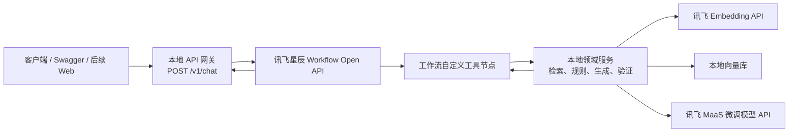

# 粮食储藏专用智能体混合技术实体设计

**状态：** 已确认设计，待实施计划

**日期：** 2026-07-19

**项目：** 粮储智研助手

**目标版本：** 技术实体 v1

## 1. 背景

项目已经具备三类原型能力：

- 讯飞 Embedding API 与本地向量库，当前包含 1023 个、2560 维的知识向量；
- 讯飞 MaaS 微调模型及其 WebSocket 推理接口；
- 讯飞 ChatDoc、星辰 Agent 工作流的探索代码和操作资料。

这些能力目前分别存在于独立脚本中，尚未形成统一入口、稳定接口、业务工作流、证据链或可测试的端到端系统。本设计的目标是先完成可运行的技术实体，不在本阶段建设完整 Web 产品、微信小程序、多租户系统或生产级运营后台。

## 2. 目标与成功标准

技术实体 v1 必须形成以下端到端链路：

> 客户端请求 → 本地 API 网关 → 讯飞星辰工作流 → 本地领域工具 → 讯飞 Embedding / 本地向量库 / 讯飞 MaaS 微调模型 → 引用验证 → 流式回答

完成标准：

1. 可以通过 Swagger 或 HTTP 客户端提交粮食储藏专业问题并收到流式回答。
2. 回答至少包含一个来自现有知识库的真实证据；检索不到有效证据时明确拒答。
3. 储粮案例缺少关键条件时，星辰工作流能够追问，而不是补造信息。
4. 讯飞 Embedding、MaaS 微调模型和星辰 Agent 工作流三类云能力都实际参与主链路。
5. 任一云端依赖失败时，接口给出可预测的降级结果或结构化错误。
6. 本地离线测试不依赖真实密钥，真实云端烟雾测试可以单独执行。

## 3. 范围

### 3.1 本阶段包含

- 一个 Python 3.11 FastAPI 服务；
- 统一的外部聊天和案例分析 API；
- 供星辰工作流调用的领域工具 API；
- 星辰 Workflow Open API 客户端；
- 讯飞 Embedding API 客户端；
- 讯飞 MaaS 微调模型 WebSocket 客户端；
- 对现有 `vectors.npy` 和 `chunks_metadata.json` 的服务化封装；
- 可追溯专业问答工作流；
- 储粮安全案例分析工作流；
- 结构化证据、引用校验、错误映射和请求级日志；
- 离线单元测试、API 契约测试和可选在线烟雾测试；
- 星辰工作流的配置、发布和联调说明。

### 3.2 本阶段不包含

- 完整 Web UI 和微信小程序；
- 用户注册、长期记忆、数据库和多租户权限；
- 大规模 OCR 与全部知识元数据治理；
- 自动连接或控制粮仓设备；
- 生产级容灾、计费、运营后台；
- 新一轮模型微调；
- 复杂向量数据库。

河南省粮食安全保障条例扫描件在完成 OCR 前不进入有效证据集合。现有知识块缺少页码、章节或条款时，对应字段返回 `null`，不得推测或填造。

## 4. 总体架构

星辰工作流是主编排器，本地 FastAPI 是统一网关和领域能力服务。客户端不直接调用讯飞接口，星辰平台也不直接访问本地向量文件。



这条链路不是递归调用：

- `/v1/chat` 只调用星辰 Workflow Open API；
- 星辰工作流只调用 `/tools/v1/*`；
- `/tools/v1/*` 只调用本地领域模块、Embedding API 或 MaaS API，不再次调用星辰工作流。

开发联调时，星辰云端需要通过受控 HTTPS 隧道访问 `/tools/v1/*`。稳定测试阶段将隧道地址替换为固定测试域名，不改变接口契约。

## 5. 职责边界

### 5.1 讯飞星辰工作流

负责：

- 识别专业问答与案例分析任务；
- 检查案例关键输入并发起追问；
- 按顺序调用检索、规则、生成和引用验证工具；
- 编排正常、证据不足、工具失败和验证失败分支；
- 保存平台 Trace；
- 生成最终工作流输出；
- 以 Workflow Open API 对外发布。

星辰工作流不负责：

- 直接读取本地向量文件；
- 保存讯飞 MaaS 或 Embedding 密钥；
- 在提示词中硬编码领域阈值；
- 绕过本地证据验证直接生成专业结论。

### 5.2 本地 API 网关

负责：

- 提供稳定的客户端入口；
- 生成 `request_id`、传递 `session_id` 与用户角色；
- 调用 Workflow Open API；
- 将星辰流式响应转换成统一 SSE 事件；
- 屏蔽星辰鉴权、工作流 ID 和原始错误结构；
- 暴露健康检查和证据详情接口。

### 5.3 本地领域服务

负责：

- 查询向量化与本地相似度检索；
- 将知识块转换为统一证据对象；
- 检查案例字段完整性并执行有来源的确定性规则；
- 组装带证据约束的模型提示；
- 调用 MaaS 微调模型；
- 检查引用 ID、引用覆盖和输出结构；
- 提供幂等的原子工具接口。

### 5.4 讯飞云端服务

- Embedding API：文档向量和查询向量；
- MaaS 微调模型 API：领域化答案生成；
- 星辰 Agent：任务编排、分支、追问、Trace 与发布。

## 6. API 契约

### 6.1 外部 API

#### `POST /v1/chat`

请求：

```json
{
  "message": "低温储粮如何控制温度和水分？",
  "session_id": "optional-session-id",
  "user_id": "optional-anonymous-id",
  "role": "student"
}
```

`role` 允许值为 `student`、`teacher`、`researcher`、`technician`，缺省为 `student`。

响应类型为 `text/event-stream`，只使用以下事件：

```text
event: meta
data: {"request_id":"...","session_id":"..."}

event: delta
data: {"content":"..."}

event: citations
data: {"items":[...]}

event: done
data: {"finish_reason":"stop"}
```

失败时：

```text
event: error
data: {"code":"WORKFLOW_UNAVAILABLE","message":"智能体工作流暂时不可用","retryable":true}
```

#### `POST /v1/cases/analyze`

请求使用结构化案例字段：

```json
{
  "session_id": "optional-session-id",
  "user_id": "optional-anonymous-id",
  "role": "technician",
  "case": {
    "grain_type": "小麦",
    "storage_type": "平房仓",
    "moisture_percent": 13.2,
    "grain_temperature_c": 18.0,
    "temperature_trend": "rising",
    "ambient_temperature_c": 26.0,
    "ambient_humidity_percent": 70.0,
    "co2_ppm": 1200,
    "co2_trend": "rising",
    "pest_signs": null,
    "mold_signs": null,
    "condensation_signs": null,
    "storage_days": 60,
    "goal": "判断是否存在霉变风险"
  }
}
```

该接口把结构化字段映射到同一个星辰工作流，不创建第二套编排逻辑。响应与 `/v1/chat` 使用相同的 SSE 事件协议。字段缺失时先发送 `meta`，再通过 `delta` 返回自然语言追问，最后在 `done` 中使用 `finish_reason="needs_input"`，并附带 `missing_fields`。

#### `GET /v1/sources/{evidence_id}`

返回证据全文片段和来源元数据。不存在时返回 `404 EVIDENCE_NOT_FOUND`。

#### `GET /health`

只检查 FastAPI 进程是否存活，不访问云端。

#### `GET /ready`

检查向量文件、元数据文件是否可加载，并对云端客户端配置做静态完整性检查；默认不产生付费 API 请求。

### 6.2 星辰工具 API

所有 `/tools/v1/*` 接口使用独立服务令牌鉴权。令牌不与任何讯飞 API 凭据复用。

| 接口 | 作用 | 幂等性 |
|---|---|---|
| `POST /tools/v1/retrieve` | 查询向量化并返回证据 | 是 |
| `POST /tools/v1/generate` | 依据问题与证据调用 MaaS | 否；只允许工作流按明确分支重试 |
| `POST /tools/v1/cases/evaluate` | 检查案例字段和确定性规则 | 是 |
| `POST /tools/v1/citations/validate` | 验证引用与输出结构 | 是 |

#### `POST /tools/v1/retrieve`

请求：

```json
{
  "request_id": "...",
  "query": "低温储粮如何控制温度和水分？",
  "top_k": 5,
  "filters": {
    "source_type": null,
    "authority_level": null
  }
}
```

响应：

```json
{
  "request_id": "...",
  "query": "...",
  "evidences": [],
  "quality": {
    "top_score": 0.0,
    "sufficient": false
  }
}
```

v1 使用当前精确余弦近邻检索。未来在 `retriever` 内部增加 BM25、RRF 或 Rerank 时，不改变该接口。

#### `POST /tools/v1/generate`

输入包括问题、角色、任务类型和最多 5 条证据。服务端使用固定系统约束组装提示词，要求模型只能依据传入证据回答，并使用证据 ID 标注来源。

输出：

```json
{
  "request_id": "...",
  "answer": "...",
  "cited_evidence_ids": ["sha256:..."],
  "usage": {
    "total_tokens": 0
  }
}
```

#### `POST /tools/v1/cases/evaluate`

先执行字段完整性检查。`grain_type`、`storage_type`、`storage_days` 和 `goal` 是所有案例的基础字段；水分、粮温、环境温湿度、CO₂ 和异常迹象是否必须，由 `goal` 对应的规则声明决定。只有该目标所需字段足够时才执行规则。v1 不引入未经来源确认的固定温度、水分、CO₂ 或药剂阈值；规则项必须带 `rule_id`、依据证据 ID 和适用条件。没有可验证规则时返回空规则结果，由检索证据和模型解释承担分析，不伪造风险等级。

#### `POST /tools/v1/citations/validate`

v1 执行确定性校验：

- 引用 ID 必须来自本次检索结果；
- 数值、法规、标准、高风险操作等关键句必须附引用；
- 引用列表不得包含未使用条目；
- 输出必须包含结论、依据、适用条件、不确定性和来源；
- 不把结构校验结果表述为语义事实已被专家证明。

关键句的确定性识别规则固定为：包含数值或单位；包含“法律、法规、标准、条款、必须、禁止、应当”；包含药剂、熏蒸、通风、制冷、设备控制等操作建议。其他普通解释性句子不因未引用而直接判定失败，但会计入引用覆盖统计。

响应包含 `valid`、`errors`、`unsupported_sentences` 和规范化后的引用列表。

## 7. 统一证据模型

```json
{
  "evidence_id": "sha256:...",
  "document_id": "sha256:...",
  "title": "中华人民共和国粮食安全保障法",
  "source": "政策文件类/中华人民共和国粮食安全保障法_20231229.docx",
  "page": null,
  "section": null,
  "article_no": null,
  "text": "...",
  "score": 0.87,
  "authority_level": "law",
  "version": "2023-12-29",
  "quality_flags": []
}
```

约束：

- `evidence_id` 根据文档标识、文本和位置稳定生成；
- `document_id` 根据规范化来源路径和文件内容校验和生成；
- `score` 是检索相关性，不代表事实正确率；
- 未知页码、章节、条款和版本使用 `null`；
- 扫描失败、文本过短或元数据缺失通过 `quality_flags` 表达；
- 引用展示使用标题和可用定位信息，不向用户展示本地绝对路径。

## 8. 工作流设计

### 8.1 可追溯专业问答

1. 开始节点接收 `message`、`request_id`、`session_id`、`role`。
2. 任务分类节点判断是否为知识问答、案例分析或越界请求。
3. 问答分支调用 `retrieve`。
4. `quality.sufficient=false` 时输出知识库证据不足，不调用生成工具。
5. 证据充分时调用 `generate`。
6. 调用 `citations/validate`。
7. 校验失败时携带错误原因重新调用 `generate` 一次。
8. 第二次仍失败时输出可确认的证据摘要和不确定性，不输出未验证结论。
9. 结束节点返回答案和结构化引用。

### 8.2 储粮安全案例分析

1. 将自然语言或结构化案例转换为统一案例字段。
2. 调用 `cases/evaluate` 检查关键字段。
3. 缺少影响判断的字段时，由工作流生成一次只询问必要信息的追问。
4. 字段满足分析条件后，将案例条件组成检索查询并调用 `retrieve`。
5. 结合规则结果和证据调用 `generate`。
6. 调用 `citations/validate`。
7. 输出风险说明、依据、适用条件、不确定性和需要人工升级的条件。

任何熏蒸、药剂使用、设备控制等高风险操作只提供规范查询和风险提示，必须要求专业人员确认，不生成自动执行指令。

## 9. 代码模块

```text
app/
├── main.py
├── api/
│   ├── chat.py
│   ├── cases.py
│   ├── sources.py
│   └── health.py
├── tools/
│   └── routes.py
├── clients/
│   ├── xingchen_workflow.py
│   ├── iflytek_embedding.py
│   └── iflytek_maas.py
├── rag/
│   ├── vector_store.py
│   ├── retriever.py
│   └── evidence.py
├── domain/
│   └── cases/
│       ├── schemas.py
│       └── rules.py
├── services/
│   ├── retrieval.py
│   ├── generation.py
│   └── citation_validation.py
├── schemas/
│   ├── api.py
│   ├── tools.py
│   └── events.py
└── core/
    ├── config.py
    ├── errors.py
    └── observability.py

tests/
├── unit/
├── contract/
├── integration/
└── online/
```

模块约束：

- API 路由只负责协议转换，不包含领域逻辑；
- `clients` 只处理第三方协议、鉴权、超时和错误映射；
- `rag` 不依赖 FastAPI；
- `services` 编排本地领域能力，但不调用星辰工作流；
- `schemas` 是星辰与本地之间的唯一数据契约；
- 旧脚本保留为迁移参考，v1 主服务不从旧脚本导入全局凭据或带副作用的代码。

## 10. 配置

所有配置从环境变量读取，并由 Pydantic Settings 在启动时校验。至少包括：

```text
XF_APP_ID
XF_EMBEDDING_API_KEY
XF_EMBEDDING_API_SECRET
XF_MAAS_API_KEY
XF_MAAS_API_SECRET
XF_MAAS_RESOURCE_ID
XF_MAAS_SERVICE_ID
XF_WORKFLOW_API_KEY
XF_WORKFLOW_API_SECRET
XF_WORKFLOW_FLOW_ID
TOOLS_SERVICE_TOKEN
VECTOR_STORE_DIR
LOG_LEVEL
```

`.env.example` 只包含变量名和非敏感示例。真实凭据不写入代码、测试固定数据、日志或设计文档。

## 11. 错误处理与降级

| 故障 | 本地处理 | 工作流行为 |
|---|---|---|
| Embedding 超时或错误 | 有限重试后返回 `EMBEDDING_UNAVAILABLE` | 停止生成，提示检索暂不可用 |
| 向量库未加载 | 返回 `VECTOR_STORE_NOT_READY` | 返回可重试错误 |
| 检索证据不足 | 正常返回 `sufficient=false` | 明确说明知识库不足 |
| MaaS 超时或流中断 | 返回 `MODEL_UNAVAILABLE` | 输出证据摘要与来源 |
| 引用第一次校验失败 | 返回具体错误 | 重新生成一次 |
| 引用第二次校验失败 | 返回仍不支持的句子 | 只输出可确认的证据内容 |
| 星辰 Workflow 不可用 | 网关映射为 SSE `error` | 客户端收到可重试状态 |
| 工具服务令牌错误 | 返回 401/403，不记录令牌 | 星辰异常分支停止流程 |

只有明确可重试且幂等的请求才自动重试。每次请求使用统一 `request_id`，日志记录节点、耗时、结果码和引用 ID，不记录 API 密钥或完整敏感文档。

## 12. 测试策略

### 12.1 单元测试

- Embedding 和 MaaS 鉴权签名；
- 环境变量校验；
- 证据 ID 的稳定性；
- 向量库加载和 Top-K 结果；
- 案例必填字段识别；
- 引用 ID、关键句和输出结构校验；
- 第三方错误到领域错误的映射。

### 12.2 适配器与契约测试

- 模拟三个讯飞接口的成功、超时、非零错误码和流式中断；
- 验证 `/v1/chat` 的 SSE 事件顺序；
- 验证四个工具接口的请求和响应模式；
- 验证工具鉴权；
- 验证工作流原始事件不会泄露到客户端。

### 12.3 本地集成测试

- 使用临时向量和元数据文件完成检索；
- 使用模拟星辰、Embedding 和 MaaS 服务完成问答主链路；
- 验证证据不足、模型失败、校验失败和案例追问分支。

### 12.4 在线烟雾测试

在线测试使用单独标记，默认不随离线测试执行：

- Embedding API 单次查询；
- MaaS 微调模型单次生成；
- 星辰 Workflow API 流式调用；
- 星辰工作流通过 HTTPS 工具地址调用本地服务；
- `/v1/chat` 完整端到端问答；
- 案例缺失信息追问。

## 13. 部署与联调

### 13.1 本地开发

- FastAPI 运行在本地 Python 3.11 环境；
- 向量文件从 `vector_store/` 只读加载；
- 使用 HTTPS 隧道仅暴露 `/tools/v1/*`；
- `/v1/*` 默认只供本机或受控测试客户端访问；
- 星辰工作流工具配置指向隧道地址。

### 13.2 稳定测试

- 将同一 FastAPI 服务部署到固定 HTTPS 测试地址；
- 使用平台环境变量或服务端密钥管理；
- 更新星辰工作流工具地址并重新发布绑定；
- 保持 API 契约和工作流输入参数不变。

## 14. 星辰平台配置产物

实施完成时必须保存：

- 工作流节点清单和输入输出参数；
- 工作流版本或导出的 YAML；
- 发布后的 `flow_id` 配置方式，不记录真实密钥；
- 四个工具节点的请求/响应映射；
- 正常、证据不足、工具错误和验证失败分支截图或说明；
- Workflow Open API 联调步骤；
- Trace 查看与问题定位说明。

讯飞当前官方 Workflow Open API 使用：

- `POST https://xingchen-api.xf-yun.com/workflow/v1/chat/completions`
- 流式 HTTP(S)
- `Authorization: Bearer {API_KEY}:{API_SECRET}`
- 请求包含 `flow_id`、`uid`、`stream` 和工作流开始节点参数

官方资料：

- [讯飞星辰 Agent 开发指南](https://www.xfyun.cn/doc/spark/Agent03-%E5%BC%80%E5%8F%91%E6%8C%87%E5%8D%97.html)
- [讯飞星辰 Agent API 接入](https://www.xfyun.cn/doc/spark/Agent04-API%E6%8E%A5%E5%85%A5.html)
- [星火智能体 Workflow Open API](https://www.xfyun.cn/doc/spark/workflow.html)
- [讯飞开源大模型 Web API](https://www.xfyun.cn/doc/spark/API.html)

## 15. 后续演进

技术实体 v1 验收后，后续版本按以下顺序演进：

1. 为扫描件执行 OCR，补齐页码、章节、条款、版本和来源等级；
2. 在检索模块内部增加 BM25、RRF 和 Rerank；
3. 增加 Web 对话界面、证据卡片和用户反馈；
4. 建立独立评测集和自动回归门禁；
5. 增加用户、会话、权限和正式部署能力；
6. 在同一 `/v1/*` API 上适配微信小程序。

这些演进不得改变星辰工作流与本地工具之间已经发布的核心证据模型；需要增加字段时使用向后兼容的可选字段。

## 16. 已确认决策

1. 采用讯飞云端服务与本地领域服务融合的混合架构。
2. 星辰 Agent 工作流是主编排器，不是仅用于展示的旁路。
3. 本地 FastAPI 同时承担客户端网关和星辰工具服务。
4. Embedding、MaaS 微调模型和 Workflow Open API 都通过独立适配器接入。
5. v1 使用现有本地向量库，不引入新向量数据库。
6. v1 以 API 可端到端调用为完成边界，不包含完整 Web 产品。
7. 缺失来源定位时返回 `null`，无证据时拒答，不以微调模型代替事实来源。
